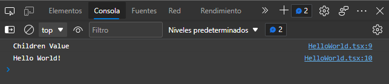

# Add React components & Typescript into rails application
Make sure thta you already have the webpacker package installed
```console
rails webpacker:install
```
## Installations & Setup
typescript
```console
rails webpacker:install:typescript
```
react
```console
rails webpacker:install:react
```
```console
rails generate react:install
```

Also we need to add one gem into our gemfile that's `react-rails`
```gemfile
gem 'react-rails'
```
react-rails is the official React community gem for integrating React with Rails. The main benefit of using this gem is the react_component helper method which makes it easy to pass Rails data to components.
```console
bundle install
```
Then run the react-rails generator:
```console
rails generate react:install
```
This creates the app/javascript/components/ directory for storing your React components. It also sets up configuration for mounting components and server-side rendering.
#### Note:
If you're using Rails 5, you'll also need to include the application.js file using the javascript_pack_tag in your application.html.erb layout file. If you already have a javascript_include_tag, replace it with the javascript_pack_tag.

##### _app/views/layouts/application.html.erb:_
```erb
<html>
  <head>
    <title>...</title>
    <%= javascript_pack_tag 'application', 'data-turbolinks-track': 'reload' %>
  </head>
</html>
```
Rails 6 automatically adds the javascript_pack_tag, so you don't need to add it manually unless you're using an older version of Rails.

#### Generator

The react-rails gem also provides a component generator to automatically create a basic component by passing it a component name and props (with their proptypes). It’s similar to Rails generators for creating models and scaffolds.

Go to the terminal a run the following command and now we can see the react generator command available
```console
rails generate --help
```
```console
Output:
...
React:
  react:component
  react:install
```
So, let's get started creating a component with the generator tool
```console
rails generate react:component HelloWorld greeting:string
```

##### _app/javascript/components/HelloWorld.js_
```js
import React from "react"
import PropTypes from "prop-types"
class HelloWorld extends React.Component {
  render () {
    return (
      <React.Fragment>
        Greeting: {this.props.greeting}
      </React.Fragment>
    );
  }
}

HelloWorld.propTypes = {
  greeting: PropTypes.string
};
export default HelloWorld
```
And now we can start usign the component `HelloWorld` into our views so for that we need to go to whatever view and put the component with the following sintax
```erb
<%= react_component("HelloWorld", { greeting: "Hello World!" }) %>
```
In this case we need to use a rail tag with the name `react_component` and this get 2 parameters, the first is the component name and the second are the props of our component. If you remember when we create the component we set a property named `greeting`. Also you can define many props if you want not only one.

Once that we already have working our react component the next step is start using typescript, so for that reason we need to change some stuffs.
First add an option in the `tsconfig` file to tell typescript that we're gonna use the react sintax. This options goes into the compilerOptions section

##### _tsconfig.json_
```json
{
  "compilerOptions": {
    ...,
    "jsx": "react-jsx"
  }
}
```

So go back and focus in to our file `HelloWorld.js`.
We need to change the extension file and add `.tsx` instead of `.js`, so the file should show as `HelloWorld.tsx` and then let's change some lines of code and add typescript sintax.

##### _app/javascript/components/HelloWorld.tsx_
```tsx
import React from "react"
import PropTypes from "prop-types"
class HelloWorld extends React.Component<IProps> {

  private props: IProps;
  constructor(_props: IProps){
    super(_props);
    this.props = _props;
    console.log(this.props.children) // the children prop is always present in all react components
    console.log(this.props.greeting)
  }

  render () {
    return (
      <React.Fragment>
        Greeting: {this.props.greeting}
      </React.Fragment>
    );
  }
}

interface IProps {
  children: String;
  greeting: String;
}

export default HelloWorld
```
##### _<some_file>.html.erb_
```erb
<%= react_component("HelloWorld", { greeting: "Hello World!", children: "Children Value" }) %>
```

console log output.



#### Almost done!
Finally we need to install the types to get the autocomplete and intellisense when we write code
```console
yarn add @types/node @types/react @types/react-dom -D
```
Also you must to change the import statement of react, like this
```tsx
import * as React from "react"
```